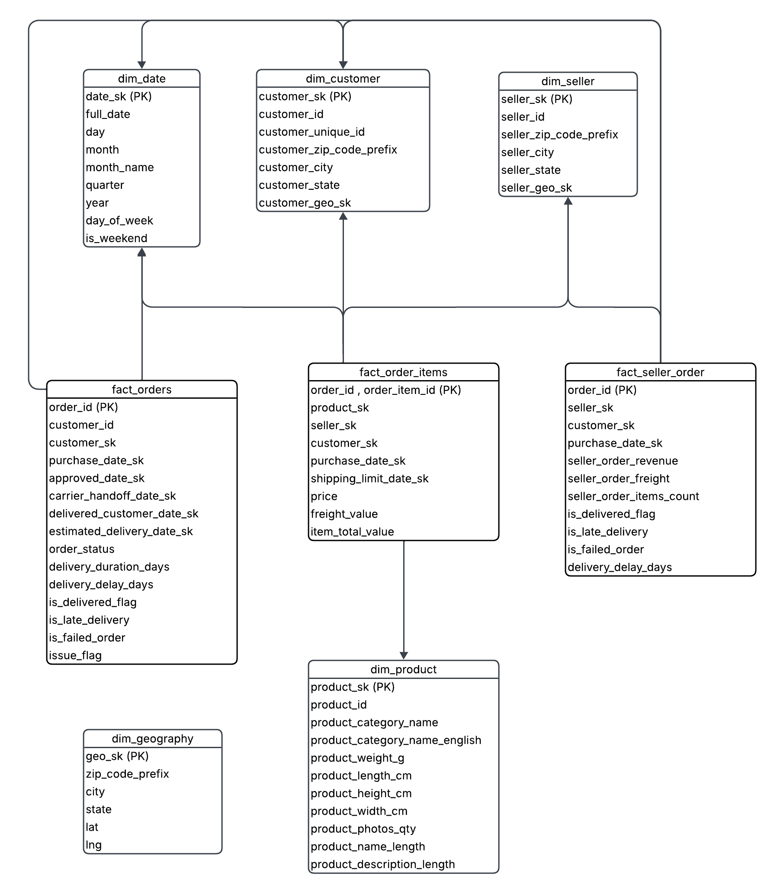
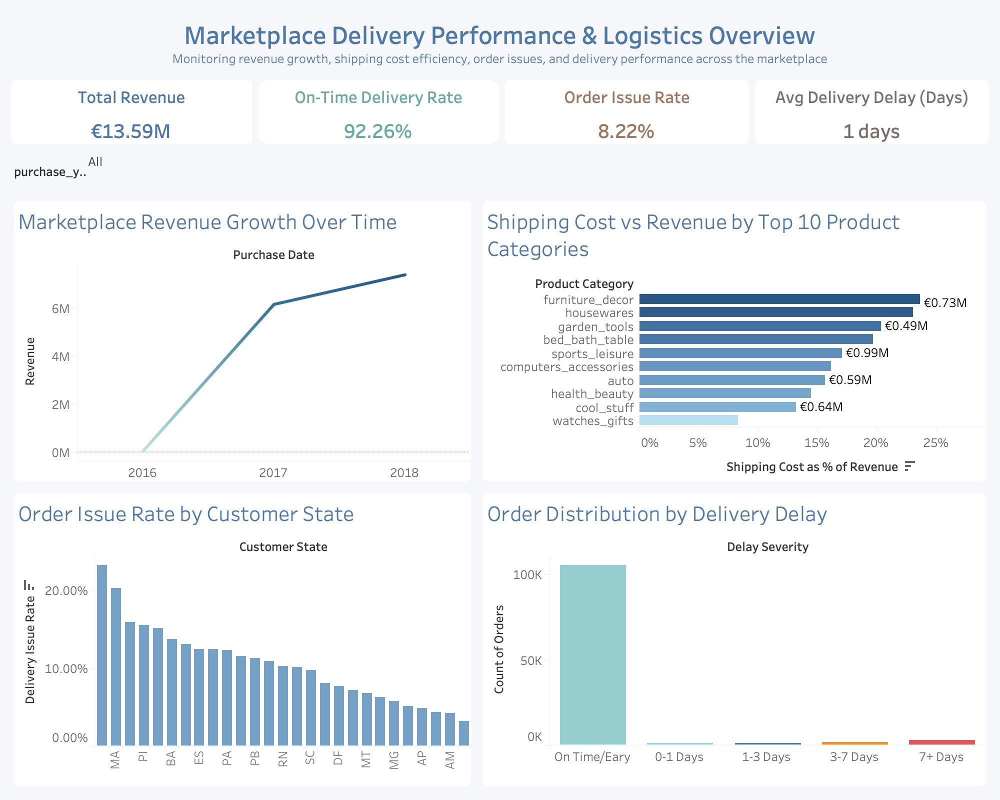
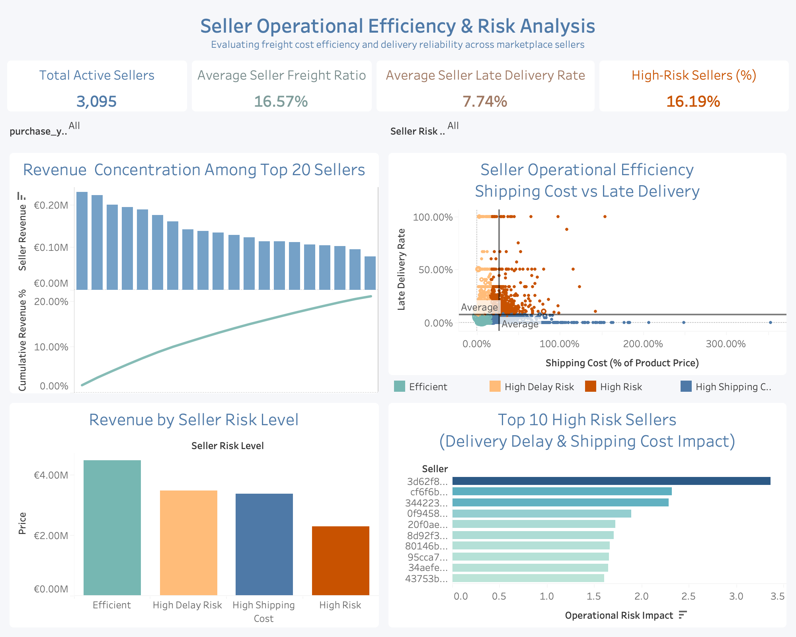

# Marketplace Logistics & Seller Performance Analytics

## Project Overview

This project develops a **business intelligence solution supported by a dimensional data warehouse** to analyse logistics performance, seller efficiency, and delivery reliability in a multi-seller e-commerce marketplace.

The analysis uses the **Olist E-commerce dataset**, consisting of nine relational datasets covering orders, products, sellers, customers, payments, reviews, and geolocation data. These datasets are integrated into a **star-schema data warehouse**, enabling scalable analytical queries and interactive business intelligence reporting.

The solution enables identification of high-risk sellers, inefficient product categories, and delivery bottlenecks that impact customer experience and operational performance.

## Key Deliverables

- **Star-schema data warehouse (PostgreSQL)**
- **Data preparation and validation pipeline (Python + Great Expectations)**
- **SQL analytical views**
- **Interactive Tableau dashboards**
- **Actionable insights on logistics inefficiencies and seller risk**
  
## Analytics Pipeline Overview

The project follows a layered data analytics architecture that transforms raw marketplace data into business intelligence insights.

**Pipeline Flow:**  
`Raw Data → Initial Data Exploration → Data Preparation & Feature Engineering → Data Validation → Data Warehouse → Semantic Layer (SQL Views) → Dashboards`

**Initial Data Exploration**: Inspecting dataset structure, value distributions, missing data patterns, and timestamp consistency to understand data quality and inform transformation steps

**Data Preparation (Python)**: Cleaning, transformation, and feature engineering

**Data Validation**: Data quality enforcement using Great Expectations

**Data Warehouse**: Dimensional modelling in PostgreSQL

**Semantic Layer**: SQL views for simplified analytical querying

**BI Layer**: Tableau dashboards for decision-making

## Business Problem
### Primary Question

How can a multi-seller e-commerce marketplace identify seller and logistics inefficiencies that negatively impact operational efficiency, delivery reliability, and customer experience?

### Key Analytical Questions

- Which high-revenue sellers exhibit inefficient logistics performance when shipping costs and delivery reliability are considered?

- Which sellers exhibit the highest late delivery rates and shipping cost inefficiencies that contribute to operational risk in the marketplace?

- How concentrated is marketplace revenue among sellers, and what operational risks may arise from this concentration?

- Which product categories exhibit the highest shipping cost relative to product value, and what does this indicate about logistics efficiency across product types?

- Which customer regions experience the highest frequency of delivery issues?

## Initial Data Exploration

Initial data exploration was performed to assess data quality, structure, and consistency prior to transformation and modelling.

Key checks included:

- **Dataset structure inspection**, reviewing column meanings, data types, and dataset sizes  
- **Granularity assessment**, identifying the level of detail of each dataset (e.g., order-level vs item-level) to inform downstream modelling  
- **Value range analysis**, examining distributions of price, freight cost, and timestamps to detect anomalies 
- **Categorical validation**, assessing values such as order status and payment types for consistency  
- **Missing data analysis**, identifying null patterns and distinguishing expected missingness from data quality issues (e.g., missing values in review-related fields were consistent with expected business scenarios such as orders without customer reviews).
- **Geographic validation**, verifying consistency of latitude and longitude records in geolocation data  
- **Temporal consistency checks**, reviewing timestamp fields (purchase, shipping, delivery) for logical correctness  

These checks ensured the datasets were understood and suitable for transformation and integration into the analytical data warehouse.

## Data Processing Pipeline

The pipeline transforms raw data into an analytical warehouse through four stages:

### 1. Data Preparation & Transformation

Raw datasets were prepared and transformed to ensure they could be integrated into the analytical data warehouse.

Key steps included:

- Converting timestamp fields to proper datetime formats
- Standardizing categorical values such as order status indicators and delivery flags  
- Aggregating geographic coordinates by ZIP code prefix to construct the geography dimension  
- Engineering derived features such as delivery duration and delivery delay indicators  
- Preparing intermediate datasets for loading into dimension and fact tables

### 2. Feature Engineering

Additional variables were derived to support logistics analytics, including:
- delivery_duration_days
- delivery_delay_days
- is_delivered_flag
- is_late_delivery
- is_failed_order
- issue_flag

These features allow direct measurement of delivery performance and operational risk.

### 3. Data Validation (Great Expectations)

Data quality validation was performed before loading the data into the warehouse.

Validation rules ensured:
- Uniqueness of primary or composite identifiers
- Non-null constraints for required fields
- Valid numeric ranges for quantitative attributes
- Correct data types for fields such as timestamps
- Valid categorical values and formats (e.g., payment types and state codes)

This step prevents incomplete, inconsistent, or invalid data from entering the analytical layer.

### 4. Loading Data into the Data Warehouse

Validated data is loaded into dimension and fact tables using surrogate keys for efficient querying.

## Data Architecture

The project uses a star schema warehouse design consisting of fact and dimension tables optimized for analytical queries.

### Dimension Tables

| Table         | Description                                         |
| ------------- | --------------------------------------------------- |
| dim_date      | Date dimension used for all timeline events   |
| dim_customer  | Customer attributes and geographic information      |
| dim_seller    | Marketplace seller information                      |
| dim_product   | Product attributes and category information         |
| dim_geography | Geographic location data (city, state, coordinates) |

### Fact Tables

| Table             | Description                                             |
| ----------------- | ------------------------------------------------------- |
| fact_orders       | Order-level information including delivery performance  |
| fact_order_items  | Individual order items including price and freight cost |
| fact_seller_order | Aggregated seller-level order metrics                   |

These fact tables capture marketplace activity at multiple levels of granularity:
- order-level events
- item-level transactions
- seller-level performance metrics

## Analytical SQL Views (Semantic Layer)

To simplify analytical queries and support BI reporting, several SQL views were created:

| View                            | Purpose                                                                            |
| ------------------------------- | ---------------------------------------------------------------------------------- |
| seller_freight_ratio      | Freight cost as a percentage of product revenue for each seller.                     |
| seller_late_delivery_rate   | Late delivery rate for each seller.                                                |
| category_revenue            | Total revenue by product category.                                                 |
| customer_issue_rate         | Delivery issue rate (late or failed orders) by customer state.                     |
| seller_performance          | Combined seller metrics including revenue, freight cost, and delivery performance. |
| seller_revenue              | Total revenue generated by each seller.                                            |
| category_late_delivery_rate | Late delivery rate by product category.                                            |
| order_item_analytics        | Fully joined analytical dataset used for dashboard queries.                        |

The `order_item_analytics` view serves as the **primary analytical dataset for the dashboards**, combining all key entities into a single analytical dataset for reporting.

## Dashboard 1: Marketplace Delivery Performance & Logistics Overview

### Purpose
This dashboard provides a high-level view of marketplace logistics performance. It enables analysis of revenue growth, delivery reliability, and shipping cost efficiency across product categories and geographic regions. It is designed to identify where delivery issues and logistics inefficiencies occur within the marketplace.

### Key Metrics

The dashboard includes high-level KPIs summarizing operational performance:

- **Total Revenue**: €13.59M
- **On-Time Delivery Rate**: 92.26%
- **Order Issue Rate**: 8.22%
- **Average Delivery Delay**: 1 day

### Main Analyses

The dashboard includes several analytical visualizations:

- **Marketplace Revenue Growth Over Time** : Yearly marketplace revenue growth
- **Shipping Cost vs Revenue by Top 10 Product Categories** : Freight cost as a percentage of product revenue across major product categories
- **Order Issue Rate by Customer State** : Geographic variation in delivery issues (late deliveries or failed orders)
- **Order Distribution by Delivery Delay** : Breakdown of delivery delay ranges across orders
  
### Key Insights

**Marketplace Revenue Growth Over Time**: 
Marketplace revenue increased substantially between 2016 and 2017 and continued to grow in 2018. This trend indicates rapid platform expansion, reflecting increased transaction volume and marketplace activity over time.

**Shipping Cost vs Revenue by Top 10 Product Categories**: 
Shipping costs vary significantly across product categories. Several categories exceed 20% of product revenue, with the highest reaching approximately 24%. Categories such as furniture_decor, housewares, garden_tools, and bed_bath_table show the highest shipping ratios, likely due to larger or more fragile items requiring specialized packaging and transportation.

**Order Issue Rate by Customer State**: 
Delivery issue rates vary considerably across customer states. The two states with the highest issue rates exceed 20%, while most other states show lower but still notable issue levels. Late deliveries occur more frequently than failed orders, indicating that delivery delays are the primary contributor to order issues.

**Order Distribution by Delivery Delay**: 
Overall delivery performance is strong, with 93.55% of orders delivered on time or early. However, a small proportion of deliveries experience delays:
* 0–1 day delay: 0.83% of orders
* 1–3 days delay: 1.04%
* 3–7 days delay: 1.78%
* 7+ days delay: 2.79%
  
Although delayed deliveries represent a relatively small share of total orders, delays exceeding seven days account for nearly 3% of deliveries, which may significantly impact customer satisfaction.

## Dashboard 2: Seller Operational Efficiency & Risk Analysis

### Purpose
This dashboard analyzes seller-level logistics performance to identify operational inefficiencies and classify sellers based on shipping cost and delivery reliability.
It supports the identification of high-risk sellers and evaluates how seller performance impacts overall marketplace revenue and operational risk.

### Key Metrics
The dashboard includes high-level KPIs summarizing seller operational performance:
- **Total Active Sellers**: 3,095
- **Average Freight Ratio**: 16.57%
- **Average Late Delivery Rate**: 7.74%
- **High-Risk Sellers**: 16.19%

### Main Analyses
The dashboard includes several analytical visualizations:
- **Revenue Concentration Among Top 20 Sellers** : Revenue contribution of the highest-performing marketplace sellers
- **Seller Operational Efficiency Matrix** : Scatter plot comparing freight ratio and late delivery rate to classify seller risk levels
- **Revenue by Seller Risk Level** : Comparison of revenue generated by sellers across different operational risk categories
- **Top 10 High-Risk Sellers** : Ranked list of sellers with the highest logistics risk based on shipping cost ratios and delivery delays

### Key Insights

**Revenue Concentration Among Top 20 Sellers:**
Approximately 21.09% of total marketplace revenue is generated by the top 20 sellers. This indicates moderate revenue concentration, where a relatively small group of sellers contributes a substantial share of platform revenue.

**Seller Operational Efficiency:**
Seller logistics performance varies considerably across the marketplace. While many sellers maintain low freight ratios and reliable delivery performance, others exhibit both high shipping costs and high late delivery rates, placing them in the high-risk operational quadrant.

**Revenue by Seller Risk Level:**
Efficient sellers generate the largest share of marketplace revenue, contributing approximately €4.5M. Sellers classified as High Delay Risk and High Shipping Cost generate similar revenue levels (around €3.4M and €3.3M respectively), while High-Risk sellers contribute the smallest share (approximately €2.3–€2.5M).
This suggests that operational inefficiencies persist even among sellers generating meaningful revenue, highlighting opportunities to improve overall marketplace logistics efficiency.

**Top 10 High-Risk Sellers:**
The analysis of the top high-risk sellers shows that many exceed the 17% freight ratio benchmark, often by a substantial margin. In several cases, shipping costs exceed the value of the product itself, with some sellers exceeding 100% freight-to-revenue ratios. This indicates inefficient logistics relative to product value.

## Linking Insights to Business Questions

The two dashboards collectively address the analytical questions defined earlier.

- The **Marketplace Logistics Performance dashboard** provides a marketplace-level perspective on delivery reliability, shipping efficiency, and geographic distribution of delivery issues.

- The **Seller Operational Efficiency dashboard** provides a seller-level perspective, identifying high-risk sellers and evaluating how logistics inefficiencies impact revenue contribution.

Together, these dashboards connect operational performance with business impact, enabling identification of inefficiencies at both marketplace and seller levels.

## Technologies Used

- **Data Processing**: Python (pandas, numpy)
- **Data Storage**: PostgreSQL
- **Data Validation**: Great Expectations
- **Business Intelligence**: Tableau Desktop
- **Development Environment**: Jupyter Notebook

## Reproducing the Analysis

1. **Download Data**  
   - Download the Olist dataset (9 CSV files) and place them in `data/raw/`

2. **Run Notebook 01 – Initial Data Exploration**  
   - Inspects dataset structure, data distributions, and data quality characteristics
  
3. **Run Notebook 02 – Data Preparation and Data Warehouse Loading (Partial)**  
   - Performs data cleaning, transformation, and feature engineering  
   - Transforms datasets into warehouse-ready structures  
   - Applies Great Expectations data validation  
   - Stop execution after validation completes  

4. **Create Data Warehouse Schema**  
   - Run SQL scripts in `sql/` to create dimension and fact tables  

5. **Load Data into Warehouse**  
   - Resume Notebook 02 to load validated data into the warehouse  

6. **Create Analytical Views**  
   - Execute SQL scripts in `sql/` to create views

7. **Build Dashboards**  
   - Connect Tableau to PostgreSQL  
   - Use `order_item_analytics` as the data source  

## Key Skills Demonstrated

- End-to-end data pipeline development (Python → SQL → BI)
- Dimensional modelling (star schema, fact/dimension design)
- Data quality validation using Great Expectations
- Analytical SQL and semantic layer design
- Business intelligence dashboard development (Tableau)
- Translating data into actionable business insights

## Business Impact & Insights

The analysis highlights several areas where marketplace performance can be improved:

- **High shipping costs in certain product categories**: Categories such as furniture_decor and housewares have shipping costs exceeding 20% of product value, suggesting a need to improve logistics efficiency or review pricing strategies.

- **Delivery delays as the main issue**: Late deliveries are the primary cause of order issues, with around 3% of orders delayed by more than seven days. Reducing delays can significantly improve customer satisfaction.

- **Regional delivery challenges**: Some customer states show much higher delivery issue rates than others, indicating where logistics improvements should be prioritised.

- **Underperforming sellers**: Some sellers have both high shipping costs and high late delivery rates, identifying clear cases for performance improvement.

- **Revenue concentration risk**: About 21% of total revenue comes from the top 20 sellers, meaning the marketplace relies heavily on a small group of sellers.

- **Opportunity to improve high-revenue sellers**: Even sellers generating strong revenue show inefficiencies, suggesting that improving their logistics performance could have a large overall impact.

## Conclusion

This project demonstrates how raw e-commerce data can be transformed into a structured BI solution using a dimensional data warehouse.

The results show that while overall marketplace performance is strong, targeted interventions on high-risk sellers and inefficient product categories can significantly improve delivery reliability and cost efficiency.
